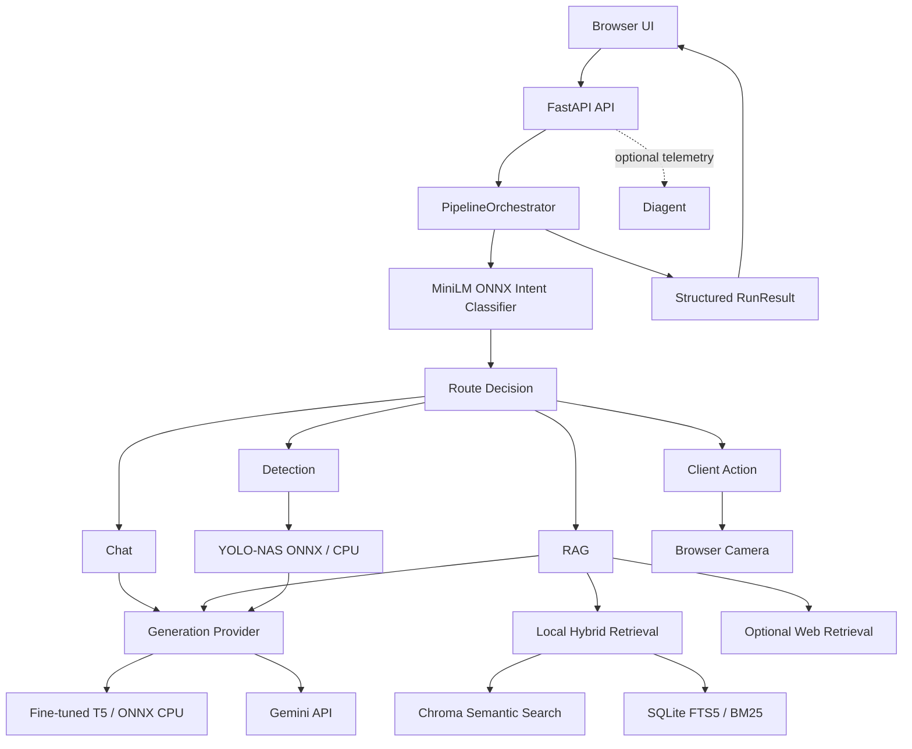

# PathFinderShip

PathFinderShip is a multimodal AI assistant with a structured FastAPI backend that routes user requests across local CPU inference, retrieval-augmented generation, optional web retrieval, API-based generation, browser camera actions, and ONNX object detection.

The default generation path uses a project-specific fine-tuned T5 model exported to quantized ONNX encoder/decoder artifacts and executed locally on CPU. The same pipeline can switch to Gemini through a provider abstraction without changing the orchestration layer.

PathFinderShip can also integrate with [Diagent](https://github.com/fatihaybsn/Diagent/tree/example/pathfindership-integration) to observe real pipeline behavior through runs, spans, retrievals, tool calls, and application-specific policy evidence.

## Highlights

- Central `PipelineOrchestrator` for request execution
- Typed Pydantic contracts for intent, routing, retrieval, generation, detection, client actions, and final results
- Fine-tuned local T5 generation through ONNX Runtime on CPU
- Optional Gemini API provider behind the same generation interface
- ONNX MiniLM intent classification with confidence-aware routing
- Hybrid RAG with Chroma semantic search and SQLite FTS5/BM25
- Optional web retrieval with explicit execution evidence
- PDF, DOCX, TXT, Markdown, and HTML upload/indexing
- YOLO-NAS ONNX object detection on CPU
- Browser-owned camera flow with backend-owned inference
- Optional fail-open Diagent observability and policy checks

## Architecture



## Structured Pipeline

The primary backend entry point is:

```text
POST /api/run
```

A request flows through:

```text
user message
    ↓
intent classification
    ↓
route decision
    ↓
selected execution path
    ├── chat
    ├── RAG
    ├── detection
    └── browser client action
    ↓
structured RunResult
```

The classifier does not directly execute services. It produces an `IntentResult`; a separate route layer decides what actually runs. This keeps prediction, orchestration, and side effects distinct.

The shared pipeline models are:

- `IntentResult`
- `RouteDecision`
- `RetrievedChunk`
- `RetrievalResult`
- `IndexingResult`
- `GenerationResult`
- `DetectionResult`
- `ClientAction`
- `RunResult`

A `RunResult` can preserve the selected route, retrieval evidence, generation metadata, detection output, fallbacks, warnings, errors, and total duration instead of returning only a final answer string.

## Generation Providers

PathFinderShip separates orchestration from text generation:

```text
BaseGenerationProvider
├── LocalT5Provider
└── GeminiProvider
```

### Local fine-tuned T5

The default provider is:

```env
GENERATION_PROVIDER=local_t5
```

The local path uses the project's fine-tuned T5 model as quantized ONNX encoder/decoder artifacts. Inference runs through ONNX Runtime with:

```text
CPUExecutionProvider
```

It supports:

- chat
- RAG answers
- model-only fallback answers
- camera action narration
- detection narration

Structured generation results preserve metadata such as model, runtime, device, prompt type, latency, token counts when available, truncation state, fallback state, and errors.

### Gemini API

The same pipeline can use Gemini:

```env
GENERATION_PROVIDER=gemini
GEMINI_API_KEY=...
GEMINI_MODEL=gemini-2.5-flash
```

The Gemini provider supports configurable timeout, maximum output tokens, and temperature while returning the same `GenerationResult` contract used by the local provider.

## Intent Classification and Routing

Intent classification uses an ONNX MiniLM model with a local tokenizer and CPU inference.

Canonical intent labels include:

- `open_camera`
- `close_camera`
- `take_photo`
- `object_detect`
- `chat`

The classifier returns confidence, threshold state, raw scores, latency, and errors.

Routing is handled separately in `route_decision.py`. It:

- applies confidence thresholds
- normalizes intent aliases
- handles classifier failures
- distinguishes predicted intent from executed route
- uses a narrow document-question heuristic for RAG routing
- records fallback reasons
- emits browser client actions when user-side capabilities are required

Execution routes include:

- `chat`
- `rag`
- `detect`
- `camera_action`

For example, object detection without an available image can return a `capture_photo` client action rather than pretending that the backend owns a browser camera.

## Hybrid RAG

PathFinderShip combines semantic and keyword retrieval.

### Semantic search

ChromaDB stores document chunks and embeddings generated with:

```text
sentence-transformers/all-MiniLM-L6-v2
```

Queries use the same embedding model and explicit query embeddings.

### Keyword search

SQLite FTS5 provides keyword retrieval with BM25 ranking.

### Score fusion

Semantic and keyword scores are normalized and combined with configurable weights:

```env
VECTOR_WEIGHT=0.75
BM25_WEIGHT=0.25
```

Results are returned as structured chunks with source, score, rank, retrieval type, and metadata.

Relevant defaults include:

```env
RAG_SCORE_THRESHOLD=0.40
RAG_TOP_K=4
RAG_MAX_CTX_TOKENS=512
```

When retrieval does not provide usable context, the pipeline uses an explicit model-only fallback path.

## Optional Web Retrieval

Web retrieval can be requested per run. The flow includes:

```text
DDGS search
    ↓
parallel page fetch
    ↓
HTML/text extraction
    ↓
chunking
    ↓
relevance scoring
    ↓
web-strength gate
```

The implementation deduplicates domains, fetches pages concurrently, filters unsupported content types, extracts readable text, and ranks candidate chunks.

The structured retrieval result explicitly separates:

```text
web search attempted
    ≠
web result survived final filtering
```

`RetrievalResult` records:

- `web_search_attempted`
- `web_search_status`
- `web_candidate_count`
- `web_error_type`

This avoids inferring that web search did not run merely because no web chunk survived the final strength gate.

## Document Upload and Indexing

Documents can be uploaded through:

```text
POST /api/upload
```

Supported formats:

- PDF
- DOCX
- TXT
- Markdown
- HTML / HTM

The indexing flow is:

```text
upload
    ↓
type and size validation
    ↓
SHA-256 content digest
    ↓
stable document ID
    ↓
text extraction
    ↓
token-aware chunking
    ↓
Chroma indexing
    ↓
SQLite FTS5 indexing
```

If the local tokenizer is unavailable, chunking falls back to a word-based strategy.

Content-derived document IDs support replacement of prior chunks in both Chroma and SQLite when the same document is indexed again.

## Object Detection and Camera Flow

Camera ownership and model inference are separated.

### Browser responsibilities

- camera permission
- live preview
- frame capture
- image upload

### Backend responsibilities

- image decoding
- YOLO-NAS ONNX inference
- confidence filtering
- IoU filtering
- non-maximum suppression
- coordinate restoration
- structured detection results

YOLO inference runs through ONNX Runtime on CPU. The service handles letterbox preprocessing, BGR-to-RGB conversion, normalized NCHW input, different score layouts, and box scaling back to the original image.

When configured, the selected generation provider can turn the detection summary into a natural-language narration.

## Frontend

The browser frontend includes:

- conversational chat
- camera preview and capture
- image upload
- document upload
- web-search toggle
- source rendering from structured retrieval results
- route and intent indicators
- browser speech recognition
- browser speech synthesis
- local chat history
- light/dark theme
- Markdown export
- response regeneration

## API

| Method | Endpoint | Purpose |
|---|---|---|
| `GET` | `/api/health` | Liveness check |
| `GET` | `/api/readiness` | Configuration and asset readiness |
| `POST` | `/api/run` | Primary structured pipeline |
| `POST` | `/api/intent` | Intent classification |
| `POST` | `/api/chat` | Direct generation |
| `POST` | `/api/rag` | Direct RAG flow |
| `POST` | `/api/detect` | Image detection and optional narration |
| `POST` | `/api/photo` | Photo persistence and background email flow |
| `POST` | `/api/upload` | Document upload and indexing |

With the backend running, FastAPI exposes interactive API documentation at:

```text
http://127.0.0.1:8000/docs
```

## Observability with Diagent

PathFinderShip can optionally send structured telemetry to [Diagent](https://github.com/fatihaybsn/Diagent/tree/example/pathfindership-integration), an observability, evaluation, and diagnosis backend for AI-agent and RAG workflows.

The integration is disabled by default:

```env
DIAGENT_ENABLED=false
```

When enabled, PathFinderShip uses a lazy, fail-open bridge around the Diagent tracer. A telemetry failure does not need to become an application failure.

The integration maps pipeline behavior into explicit telemetry:

| PathFinderShip behavior | Diagent telemetry |
|---|---|
| Intent classification | `pathfindership.intent` system span |
| Route decision | `pathfindership.route_decision` system span |
| Retrieval evidence | retrieval telemetry |
| Generation | `pathfindership.generation` LLM span |
| Web search execution | `pathfindership.web_search` tool call |
| YOLO inference | `pathfindership.yolo.detect` tool call |
| Browser action request | `pathfindership.client_action` system span |
| Policy evaluation | `pathfindership.policy_check` system span |

Retrieval telemetry is bounded and metadata is sanitized. Raw image bytes, base64 image payloads, authorization headers, API keys, and full provider responses are not required by the integration.

### Application-specific policy checks

PathFinderShip evaluates deterministic expected-vs-actual behavior for cases such as:

- RAG route without recorded retrieval
- grounded answer without source evidence
- required web fallback not executed
- unexpected YOLO execution for a non-vision route
- detection attempted without a received image
- empty generation output
- completed run without a final answer

These checks remain distinct from generic Diagent anomaly detection:

```text
telemetry tells what happened
policy defines what should have happened
```

A policy span is not automatically an alert and is not automatically a diagnosis trigger.

The worked Diagent-side reference integration is available at:

**https://github.com/fatihaybsn/Diagent/tree/example/pathfindership-integration**

That branch demonstrates bounded consumption of failed `pathfindership.policy_check` evidence by the diagnostician while preserving alert and trigger semantics.

## Project Structure

```text
PathFinder-Ship/
├── backend/
│   ├── schemas/
│   │   └── pipeline.py
│   ├── services/
│   │   ├── generation/
│   │   ├── observability/
│   │   ├── rag_backend/
│   │   ├── document_indexing.py
│   │   ├── nlu_classifier.py
│   │   ├── pipeline_orchestrator.py
│   │   ├── rag.py
│   │   ├── route_decision.py
│   │   ├── t5.py
│   │   └── yolo.py
│   ├── tests/
│   ├── utils/
│   ├── web/
│   │   └── app.py
│   ├── config.py
│   └── main.py
├── frontend/
│   ├── app.js
│   ├── index.html
│   └── styles.css
├── .env.example
├── requirements.txt
└── README.md
```

## Setup

### 1. Create a virtual environment

Windows PowerShell:

```powershell
python -m venv .venv
.\.venv\Scripts\Activate.ps1
```

macOS/Linux:

```bash
python -m venv .venv
source .venv/bin/activate
```

Install dependencies:

```bash
python -m pip install --upgrade pip
python -m pip install -r requirements.txt
```

### 2. Create local configuration

Windows PowerShell:

```powershell
Copy-Item .env.example backend\.env
```

macOS/Linux:

```bash
cp .env.example backend/.env
```

Keep secrets out of source control.

### 3. Choose a generation provider

Local T5:

```env
GENERATION_PROVIDER=local_t5
```

Default local asset paths:

```env
T5_TOKENIZER_DIR=assets/models/t5/tokenizer
T5_ENCODER=assets/models/t5/encoder_model_int8.onnx
T5_DECODER=assets/models/t5/decoder_model_int8.onnx
```

Gemini:

```env
GENERATION_PROVIDER=gemini
GEMINI_API_KEY=...
GEMINI_MODEL=gemini-2.5-flash
```

### 4. Run the backend

```bash
cd backend
python main.py
```

The API runs on:

```text
http://127.0.0.1:8000
```

### 5. Run the frontend

From the repository root:

```bash
cd frontend
python -m http.server 5173
```

Open:

```text
http://localhost:5173
```

## Readiness

With the backend running:

```text
GET /api/readiness
```

PowerShell example:

```powershell
Invoke-RestMethod http://127.0.0.1:8000/api/readiness
```

The readiness response reports expected T5, NLU, YOLO, RAG corpus, Chroma, SQLite, generation-provider, feature-flag, and Diagent configuration state.

It verifies configuration and expected assets; it does not perform full model inference.

## Optional Diagent Setup

Enable observability in `backend/.env`:

```env
DIAGENT_ENABLED=true
DIAGENT_API_URL=http://localhost:8001
DIAGENT_AGENT_NAME=pathfindership
DIAGENT_FAIL_OPEN=true
```

Use the actual Diagent backend URL. If PathFinderShip and Diagent run on the same machine, assign them different ports.

The Diagent package must be importable by the PathFinderShip process. With sibling repositories:

```text
workspace/
├── Diagent/
└── PathFinder-Ship/
```

install Diagent in editable mode:

```bash
python -m pip install -e ../Diagent
```

Run the Diagent backend separately and point `DIAGENT_API_URL` to it.

Reference integration:

**https://github.com/fatihaybsn/Diagent/tree/example/pathfindership-integration**

## Configuration

Selected environment variables:

| Variable | Default | Purpose |
|---|---|---|
| `GENERATION_PROVIDER` | `local_t5` | Select `local_t5` or `gemini` |
| `CLS_ROUTE_THRESHOLD` | `0.60` | Intent confidence threshold |
| `RAG_SCORE_THRESHOLD` | `0.40` | Local retrieval threshold |
| `RAG_TOP_K` | `4` | Number of local retrieval candidates |
| `VECTOR_WEIGHT` | `0.75` | Semantic score weight |
| `BM25_WEIGHT` | `0.25` | Keyword score weight |
| `RAG_WEB_MIN_STRENGTH` | `0.75` | Web result strength gate |
| `ENABLE_EMAIL` | `false` | Enable email-related behavior |
| `DIAGENT_ENABLED` | `false` | Enable Diagent telemetry |
| `DIAGENT_MAX_RETRIEVAL_CHUNKS` | `5` | Bound retrieval telemetry |
| `DIAGENT_MAX_CHUNK_CHARS` | `1200` | Bound telemetry chunk text |

See `.env.example` for the full configuration surface.

## Testing

Run the Python test suite from the repository root:

```bash
pytest -q
```

The suite covers pipeline schemas, route decisions, orchestration, structured RAG evidence, generation providers, local T5 results, upload/indexing, YOLO results, Diagent telemetry mapping, policy checks, and readiness behavior.

Frontend source extraction has a focused JavaScript test:

```bash
node frontend/test_extract_sources.js
```
