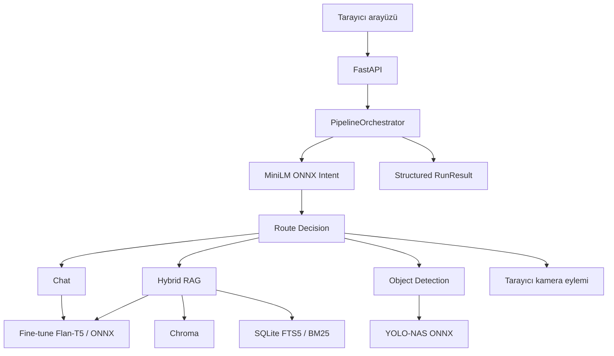

# PathFinderShip

PathFinderShip; yerel CPU model çıkarımı, retrieval-augmented generation, isteğe bağlı web araması, kamera eylemleri ve ONNX nesne tespitini tek bir yapılandırılmış FastAPI hattında birleştiren çok modlu bir yapay zekâ asistanıdır.

[English README](README.md)

## Öne çıkanlar

- Merkezi `PipelineOrchestrator` ve Pydantic veri sözleşmeleri
- Beş sınıflı, fine-tune edilmiş MiniLM intent sınıflandırıcısı ve INT8 ONNX çıkarımı
- Chat+RAG için fine-tune edilmiş Flan-T5 Large LoRA ve quantized ONNX encoder/decoder
- Chroma semantic search ile SQLite FTS5/BM25 kullanan hibrit RAG
- Yerel Flan-T5 ve Gemini arasında değiştirilebilir generation provider yapısı
- YOLO-NAS ONNX üretim entegrasyonu ve tarihsel YOLO11 PT/ONNX doğrulama çalışması
- PDF, DOCX, TXT, Markdown ve HTML yükleme/indeksleme
- İsteğe bağlı Diagent gözlemlenebilirliği ve policy kontrolleri

## Mimari



## Model geliştirme kanıtları

Projede kullanılan MiniLM ve Flan-T5 modelleri, pretrained checkpoint'lerin proje için toplanan/hazırlanan verilerle fine-tune edilmesiyle geliştirildi. Modellerin sıfırdan eğitildiği iddia edilmemektedir. Başarısız ve ara deneyler de en iyi modelle birlikte belgelenmektedir.

Salt okunur yerel arşiv denetiminde:

- 18,46 GiB büyüklüğünde 459 ilgili dosya,
- 32 model artifact'ı ve 16 eğitime devam dosyası,
- eğitim/değerlendirme amaçlı 34 notebook,
- 4 Trainer state ve 52 SHA-256 kopya grubu bulundu.

### Tarihsel sonuçlar

| Deney | Değişiklik | Tarihsel sonuç | Sınırlama |
|---|---|---:|---|
| MiniLM-L6 | 5 intent, 4 epoch, LR 2e-5 | 600 örnekte accuracy 1.000; macro-F1 1.000 | Eski train/validation/test bölümlerinde tekrar ve kesişimler bulundu; temiz ana sonuç olarak kullanılmayacak. |
| Erken Flan-T5 Base | Chat + dört bit command, early stopping | epoch 13'te en iyi val loss 0.7815; epoch 16'da durdu | Eski 20 örnekli command testinin paydası hatalıydı. |
| Large LoRA q/v (`kötü`) | Yalnız q/v hedefleri, r=16, alpha=32 | Trainer best eval loss 1.8437; ayrı full eval loss 32.1334 | Reddedilen deney; eksik adapter config kod ve tensor yapısından yeniden kurulmuş olarak işaretlendi. |
| Large LoRA 2x RAG | Yedi LoRA hedefi, RAG ağırlığı 2.0 | best eval loss 0.9845; tarihsel loss iyileşmesi yaklaşık %14–20 | Bazı eski promptlarda çift tag sorunu var. |
| Large LoRA 1.2x Chat | Chat ağırlığı 1.2 | step 1980 eval loss 0.9585; RAG EM 0.742/F1 0.8609 | Eski validation bölümünde az sayıda tekrar sızıntısı var. |
| My Class Second Try | Chat 1.7, görev bazlı smoothing, kısmi R-Drop | eval loss 1.0937; hızlı RAG EM 0.805/F1 0.9148 | Eski chat testi `max_time=1.2s` nedeniyle çıktıları ciddi biçimde kesti. |

### Benchmark v1

Yeni benchmark bütün yüklenebilir benzersiz modelleri aynı uyumlu testlerde çalıştırmak için hazırlandı:

- dengeli 1.000 intent örneği,
- 600 Chat+Command örneği,
- Google IFEval ve 300 proje chat örneği,
- HotpotQA hariç RAGBench test bölümleri ve 160 cevaplanabilir/cevaplanamaz proje örneği,
- YOLO11 pretrained entegrasyonu için COCO val2017.

316.486 benzersiz eğitim girdisi imzası kullanılarak test verisi çakışmaları elenecektir. Yeni sonuçlar; ham tahminler, JSON metrikler, `%95` güven aralıkları, ortam bilgisi, SHA-256 manifesti, grafikler ve hata kayıtlarıyla birlikte yayınlanacaktır.

Belgeler: [benchmark protokolü](BENCHMARK_PLAN.md), [deney günlüğü](docs/model-development/EXPERIMENTS.md), [dataset kartı](docs/model-development/DATASET_CARD.md), [artifact envanteri](docs/model-development/evidence/ARTIFACT_INVENTORY.md) ve [veri sızıntısı denetimi](docs/model-development/evidence/TRAINING_DATA_AUDIT.md).

> Lightning AI sonuçları dönüp hash ve şema doğrulamasından geçene kadar yeni Benchmark v1 sayıları README'ye eklenmeyecektir.

## Yerel çalıştırma

```bash
python -m venv .venv
source .venv/bin/activate
pip install -r requirements.txt
uvicorn backend.web.app:app --reload
```

Windows PowerShell'de aktivasyon komutu:

```powershell
.venv\Scripts\Activate.ps1
```

Detaylı API, RAG, provider ve Diagent yapılandırması için İngilizce README'deki ilgili bölümlere bakın.
