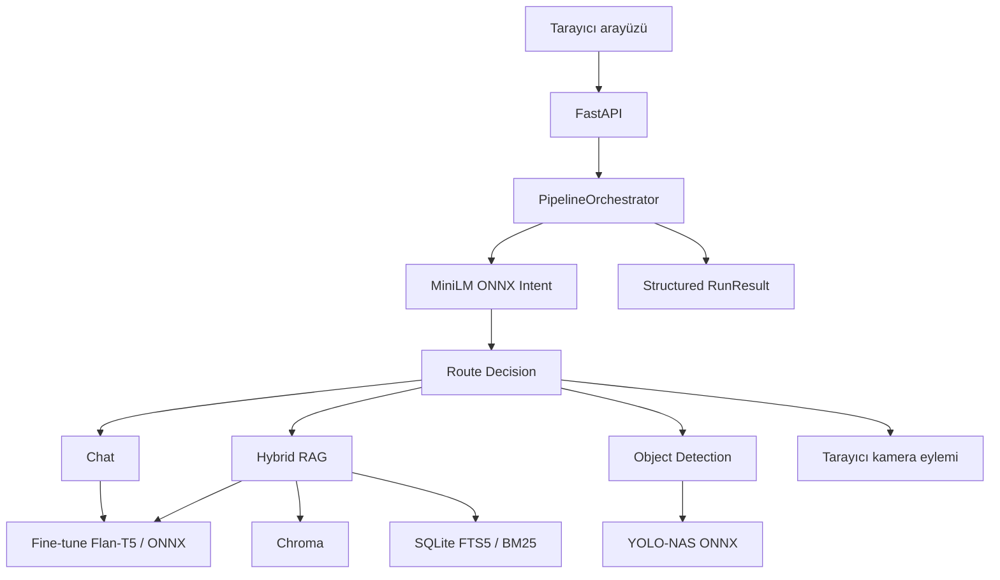
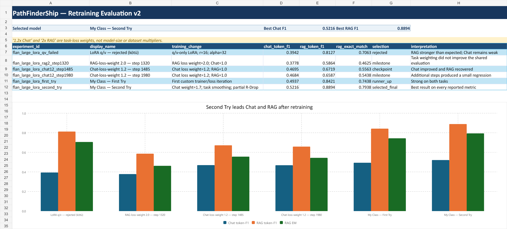

# PathFinderShip

PathFinderShip; yerel CPU model çıkarımı, retrieval-augmented generation, isteğe bağlı web araması, kamera eylemleri ve ONNX nesne tespitini tek bir yapılandırılmış FastAPI hattında birleştiren çok modlu bir yapay zekâ asistanıdır.

[English README](README.md)

## Öne çıkanlar

- Merkezi `PipelineOrchestrator` ve Pydantic veri sözleşmeleri
- Beş sınıflı, fine-tune edilmiş MiniLM intent sınıflandırıcısı ve INT8 ONNX çıkarımı
- Chat+RAG için fine-tune edilmiş Flan-T5 Large LoRA ve quantized ONNX encoder/decoder
- Chroma semantic search ile SQLite FTS5/BM25 kullanan hibrit RAG
- Yerel Flan-T5 ve Gemini arasında değiştirilebilir generation provider yapısı
- YOLO-NAS ONNX üretim entegrasyonu ve tarihsel YOLO11 PT/ONNX doğrulama çalışması
- PDF, DOCX, TXT, Markdown ve HTML yükleme/indeksleme
- İsteğe bağlı Diagent gözlemlenebilirliği ve policy kontrolleri

## Mimari



## Model geliştirme kanıtları

Projede kullanılan MiniLM ve Flan-T5 modelleri, pretrained checkpoint'lerin proje için toplanan/hazırlanan verilerle fine-tune edilmesiyle geliştirildi. Modellerin sıfırdan eğitildiği iddia edilmemektedir. Başarısız ve ara deneyler de en iyi modelle birlikte belgelenmektedir.

Salt okunur yerel arşiv denetiminde:

- 18,46 GiB büyüklüğünde 459 ilgili dosya,
- 32 model artifact'ı ve 16 eğitime devam dosyası,
- eğitim/değerlendirme amaçlı 34 notebook,
- 4 Trainer state ve 52 SHA-256 kopya grubu bulundu.

### Yeniden eğitim değerlendirmesi v2

Güncellenen altı Flan-T5 Large LoRA adapter'ı aynı 300 örnekli Chat ve 160 örnekli proje RAG setlerinde değerlendirildi. Özgün klasör adlarındaki `1.2x Chat` ve `2x RAG`, **görev bazlı loss ağırlıklarını** ifade eder; model ölçekleme veya veri çoğaltma anlamına gelmez.

| Deney | Bilinçli eğitim değişikliği | Chat token-F1 | RAG token-F1 | RAG EM | Karar |
|---|---|---:|---:|---:|---|
| LoRA q/v — `kötü` | Yalnız q/v LoRA, r=16, alpha=32 | 0.3942 | 0.8127 | 0.7063 | Reddedildi: Chat zayıf kaldı |
| RAG-loss-weight 2.0 — step 1320 | RAG loss ağırlığı 2.0; Chat 1.0 | 0.3778 | 0.5864 | 0.4625 | Ağırlıklandırma ortak test sonucunu iyileştirmedi |
| Chat-loss-weight 1.2 — step 1485 | Chat loss ağırlığı 1.2; RAG 1.0 | 0.4695 | 0.6719 | 0.5563 | Ara checkpoint |
| Chat-loss-weight 1.2 — step 1980 | Aynı ağırlık, daha fazla optimizasyon adımı | 0.4684 | 0.6587 | 0.5438 | Step 1485'e göre küçük gerileme |
| My Class — First Try | İlk özel trainer/loss denemesi | 0.4937 | 0.8421 | 0.7438 | Güçlü ikinci aday |
| **My Class — Second Try** | Chat 1.7, görev smoothing, kısmi R-Drop | **0.5216** | **0.8894** | **0.7938** | **Seçilen final; raporlanan bütün metriklerde en iyi** |



Sonuçlar kötü ve ara denemelerin neden korunması gerektiğini gösteriyor: RAG ağırlığı `2.0` fayda sağlamadı, Chat ağırlığı `1.2` Chat sonucunu iyileştirdi ve aynı deneyi step 1485'ten 1980'e uzatmak küçük bir gerileme oluşturdu. En dengeli sonuç özel Second Try ayarından geldi. Görevler arasında birleşik skor üretilmedi; değerler genel “başarı yüzdesi” gibi değil, metrik adlarıyla raporlandı.

### MiniLM intent sonucu

Değiştirilmeyen MiniLM-L6 INT8 ONNX modeli, sabit ve dengeli 1.000 örnekli intent setinde accuracy, macro-F1 ve weighted-F1 için `1.0000`; ECE için `0.1813` aldı. Kusursuz etiket skoru yalnızca bu proje stress seti için geçerlidir; ECE güven skorlarının kusursuz kalibre olmadığını gösterir.

[V2 sonuç kartı](docs/model-development/results/retraining-v2/RESULT_CARD.md), makine tarafından okunabilir [JSON](docs/model-development/results/retraining-v2/metrics/flan_retraining_results.json), düzenlenebilir [CSV](docs/model-development/results/retraining-v2/metrics/flan_retraining_results.csv), denetlenebilir [çalışma kitabı](docs/model-development/results/retraining-v2/metrics/flan_retraining_results.xlsx), güncel görseller ve iddia sınırlarını birbirine bağlar. Tarihsel notebook loss değerleri [deney günlüğünde](docs/model-development/EXPERIMENTS.md) korunur; v2 değerlendirme metriği gibi yeniden etiketlenmez. Ayrıca [benchmark protokolü](BENCHMARK_PLAN.md), [dataset kartı](docs/model-development/DATASET_CARD.md), [artifact envanteri](docs/model-development/evidence/ARTIFACT_INVENTORY.md) ve [veri sızıntısı denetimi](docs/model-development/evidence/TRAINING_DATA_AUDIT.md) yayınlanır.

## Yerel çalıştırma

```bash
python -m venv .venv
source .venv/bin/activate
pip install -r requirements.txt
uvicorn backend.web.app:app --reload
```

Windows PowerShell'de aktivasyon komutu:

```powershell
.venv\Scripts\Activate.ps1
```

Detaylı API, RAG, provider ve Diagent yapılandırması için İngilizce README'deki ilgili bölümlere bakın.
